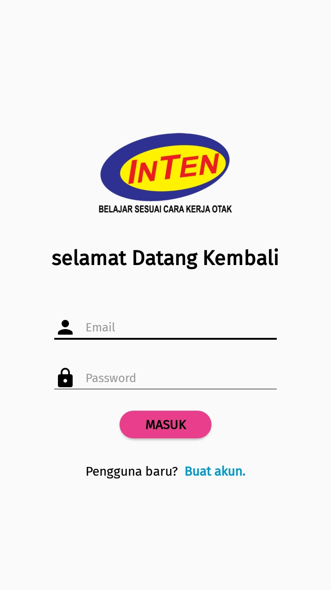
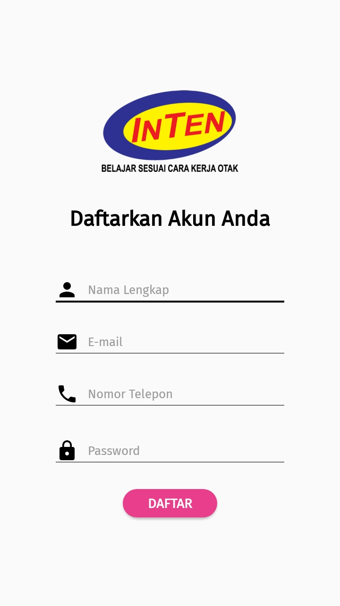
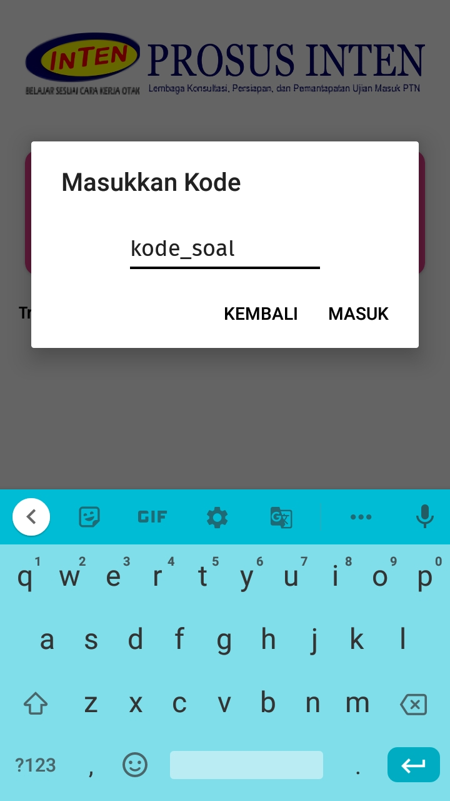
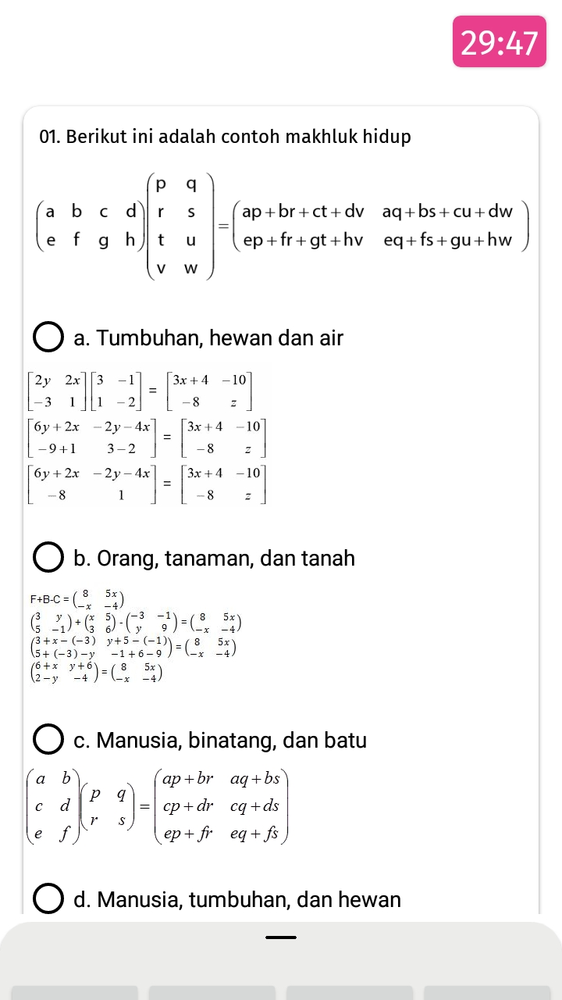
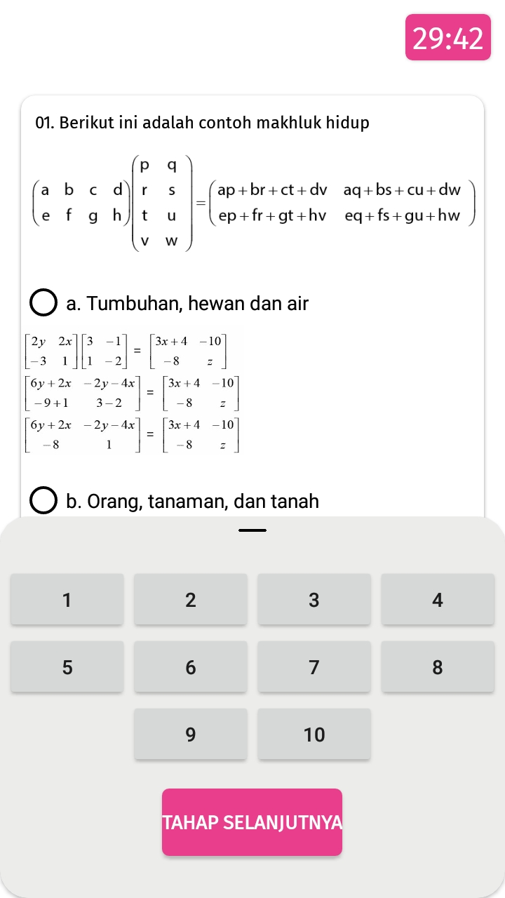
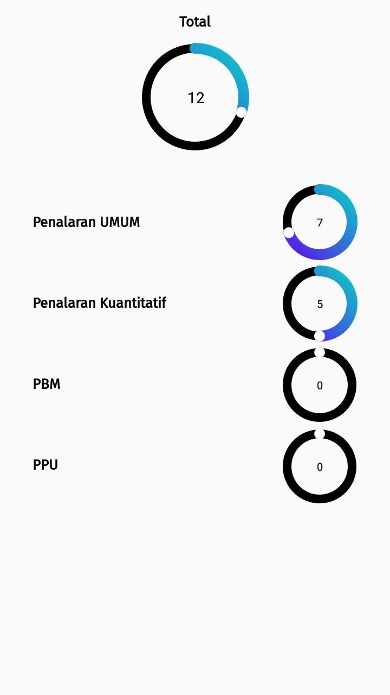

# test-online-inten
aplikasi ini bertujuan untuk ujian tryout sbmptn melalui menggunakan aplikasi mobile android
database menggunakan beberapa service dari FIREBASE diantaranya firebase realtime database, firestore dan firebase auth
aplikasi ini saya buat saat magang di salah satu tempat kursus

berikut ini beberapa screenshot activity yang ada dalam aplikasi  

### tampilan awal

### tampilan login

### tampilan register

### tampilan dashboard

### tampilan masuk kode soal

### tampilan lembar soal

### tampilan lembar soal dan navigator soal

### tampilan hasil ujian

### struktur basis data firebase

